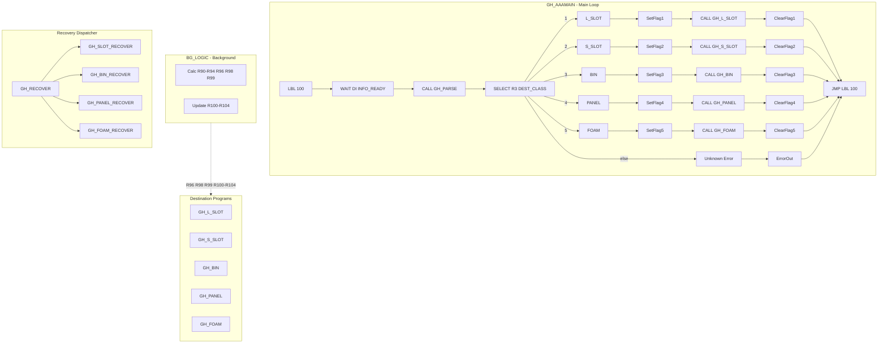

# GH Optimal Architecture — Ultimate Implementation Blueprint

**Application:** Infeed Sort to Cart Placement (L_SLOT, S_SLOT, BIN, PANEL, FOAM)  
**Controller:** R-30iB Plus, 7-axis w/ E1 Track  
**Date:** February 23, 2026  
**Prepared for:** The Way Automation LLC

**Source:** Current [GH_PROGRAM_FILES](GH_PROGRAM_FILES), [PROGRAM_REVIEW_2026-02-23.md](PROGRAM_REVIEW_2026-02-23.md), [FANUC_Optimized_Dataset](FANUC_Optimized_Dataset)

---

## 1. System Architecture (Optimal Flow)



---

## 2. Optimal GH_AAAMAIN (Main Program)

**Pattern:** LBL[100] loop, UFRAME/UTOOL/PAYLOAD at top, SELECT with ELSE, JMP LBL[100] after every branch.

```
!MAIN PROGRAM - Infeed Sort to Cart
UFRAME_NUM=0 ;
UTOOL_NUM=1 ;
PAYLOAD[1] ;

LBL[100] ;
  DO[29:IN WAIT]=ON ;
  WAIT DI[56:INFO READY] TIMEOUT,LBL[20100] ;
  DO[29:IN WAIT]=OFF ;
  DO[21:INFO REGISTERED]=PULSE,0.5sec ;
  R[1:PART INDEX]=GI[2:PART INDEX] ;
  R[2:SORT CODE]=GI[1:SORT INDEX] ;
  CALL GH_PARSE ;

  !Unknown part - error and loop
  IF (R[3:DEST_CLASS]=0),JMP LBL[99] ;

  !PROGRAM SELECTION
  SELECT R[3:DEST_CLASS]=1,JMP LBL[1] ;
         =2,JMP LBL[2] ;
         =3,JMP LBL[3] ;
         =4,JMP LBL[4] ;
         =5,JMP LBL[5] ;
         ELSE,JMP LBL[99] ;

  !L_SLOT
  LBL[1] ;
  F[1:L_SLOT]=(ON) ;
  CALL GH_L_SLOT ;
  F[1:L_SLOT]=(OFF) ;
  JMP LBL[100] ;

  !S_SLOT
  LBL[2] ;
  F[2:S_SLOT]=(ON) ;
  CALL GH_S_SLOT ;
  F[2:S_SLOT]=(OFF) ;
  JMP LBL[100] ;

  !BIN
  LBL[3] ;
  F[3:BIN]=(ON) ;
  CALL GH_BIN ;
  F[3:BIN]=(OFF) ;
  JMP LBL[100] ;

  !PANEL
  LBL[4] ;
  F[4:PANEL]=(ON) ;
  CALL GH_PANEL ;
  F[4:PANEL]=(OFF) ;
  JMP LBL[100] ;

  !FOAM
  LBL[5] ;
  F[5:FOAM]=(ON) ;
  CALL GH_FOAM ;
  F[5:FOAM]=(OFF) ;
  JMP LBL[100] ;

  !Unknown part error
  LBL[99] ;
  GO[1:ERROR CODE]=4 ;
  WAIT .25(sec) ;
  GO[1:ERROR CODE]=0 ;
  JMP LBL[100] ;

  !Timeout on INFO READY
  LBL[20100] ;
  UALM[1] ;
  JMP LBL[100] ;
```

**Key improvements:** PAYLOAD, UFRAME/UTOOL, SELECT ELSE, JMP LBL[100] after each branch, WAIT TIMEOUT, correct flag clears.

---

## 3. Optimal BG_LOGIC (Simplified)

**Remove dead code.** R[96] has one formula: `R[2]+128`. Fix R[102] to use R[R[92]].

**Note:** R[99:UFRAME_TEMP] varies by destination type. Current logic:
- L_SLOT, BIN: R[99]=R[2]+21
- S_SLOT: R[99]=R[2]+15
- PANEL: R[99]=R[2]+11

Keep flag-based R[99] if needed. Remove R[96] from lines 4, 10, 17 (always overwritten by line 52).

```
!UFRAME CALC (flag-based - BG runs during destination)
IF (F[1:L_SLOT]=ON OR F[3:BIN]=ON) THEN ;
  R[99:UFRAME_TEMP]=R[2:SORT CODE]+21 ;
ENDIF ;
IF (F[2:S_SLOT]=ON) THEN ;
  R[99:UFRAME_TEMP]=R[2:SORT CODE]+15 ;
ENDIF ;
IF (F[4:PANEL]=ON) THEN ;
  R[99:UFRAME_TEMP]=R[2:SORT CODE]+11 ;
ENDIF ;

!CURRENT COUNT TRACKER
R[90:LSLOTREG]=R[2:SORT CODE]+24 ;
R[100:L_SLOT_COUNT]=R[R[90]] ;

R[91:SSLOTREG]=R[2:SORT CODE]+34 ;
R[101:S_SLOT_COUNT]=R[R[91]] ;

R[92:PANELREG]=R[2:SORT CODE]+44 ;
R[102:PANEL_COUNT]=R[R[92]] ;

R[93:BIN1REG]=(2*R[2:SORT CODE])+3 ;
R[94:BIN2REG]=(2*R[2:SORT CODE])+4 ;
R[103:BIN1_COUNT]=R[R[93]] ;
R[104:BIN2_COUNT]=R[R[94]] ;

!PR SELECTOR
R[98:PR_REG]=R[1:PART INDEX]+100 ;

!DI SELECTOR
R[96:DI_REG]=R[2:SORT CODE]+128 ;
```

---

## 4. Optimal GH_PARSE (Defensive)

**Pattern:** Initialize R[3]=0, set only on match, check at end.

```
!PART INFO PARSER
R[3:DEST_CLASS]=0 ;
F[10:SMALL FOAM]=(OFF) ;

IF (R[1:PART INDEX]=11),R[3:DEST_CLASS]=5 ;
IF (R[1:PART INDEX]=12) THEN ;
  R[3:DEST_CLASS]=5 ;
  F[10:SMALL FOAM]=(ON) ;
ENDIF ;
IF (R[1:PART INDEX]=18) THEN ;
  R[3:DEST_CLASS]=1 ;
  R[4:LENGTH_CLASS]=4 ;
ENDIF ;
IF (R[1:PART INDEX]=24),R[3:DEST_CLASS]=4 ;
IF (R[1:PART INDEX]=25) THEN ;
  R[3:DEST_CLASS]=1 ;
  R[4:LENGTH_CLASS]=3 ;
ENDIF ;
IF (R[1:PART INDEX]=26) THEN ;
  R[3:DEST_CLASS]=2 ;
  R[4:LENGTH_CLASS]=1 ;
ENDIF ;
IF (R[1:PART INDEX]=27) THEN ;
  R[3:DEST_CLASS]=1 ;
  R[4:LENGTH_CLASS]=2 ;
ENDIF ;
IF (R[1:PART INDEX]=32) THEN ;
  R[3:DEST_CLASS]=4 ;
  F[10:SMALL FOAM]=(ON) ;
ENDIF ;
IF (R[1:PART INDEX]=34) THEN ;
  R[3:DEST_CLASS]=1 ;
  R[4:LENGTH_CLASS]=3 ;
ENDIF ;
IF (R[1:PART INDEX]=36),R[3:DEST_CLASS]=3 ;

!Catch-all - unknown part
IF (R[3:DEST_CLASS]=0) THEN ;
  GO[1:ERROR CODE]=4 ;
  WAIT .25(sec) ;
  GO[1:ERROR CODE]=0 ;
ENDIF ;
```

**Alternative:** Use SELECT R[1] with cases for cleaner structure.

---

## 5. Shared Macros (DRY Principle)

**Extract repeated logic into macros.** Reference: `FANUC_Optimized_Dataset/optimized_dataset/examples/EG_Chuck_Operations.txt`.

| Macro | Purpose | Used By |
|-------|---------|---------|
| **GH_GRIP_RESET** | RO[1]-RO[6]=OFF at start | BIN, PANEL, FOAM, L_SLOT, S_SLOT |
| **GH_CART_SAFE** | WAIT DI[R[96]]=ON TIMEOUT + UALM | All cart programs |
| **GH_OFFSET_PICK** | Apply LENGTH_CLASS to PR[10,1] or PR[10,2] | L_SLOT, S_SLOT |
| **GH_OFFSET_PLACE** | Apply LENGTH_CLASS to PR[10,3] | L_SLOT, S_SLOT |

### GH_GRIP_RESET (Macro)

```
RO[1:spread eagle]=OFF ;
RO[2:ALL MAGNETS]=OFF ;
RO[3:CLAMSHELL]=OFF ;
RO[4:VACUUM EXHAUST]=OFF ;
RO[5:VACUUM]=OFF ;
RO[6:SPREAD EAGLE VAC]=OFF ;
```

### GH_CART_SAFE (with TIMEOUT)

```
IF (DI[R[96]]=OFF) THEN ;
  GO[1:ERROR CODE]=102 ;
  WAIT .25(sec) ;
  GO[1:ERROR CODE]=0 ;
  WAIT DI[R[96]]=ON TIMEOUT,LBL[20100] ;
  LBL[20100] ;
  UALM[2] ;
  JMP LBL[20100] ;
ENDIF ;
```

**Note:** Use unique LBL numbers per program if CALLed from multiple places (e.g., LBL[20101], LBL[20102]).

---

## 6. Destination Program Template (Pick-Place Pattern)

**Standard structure for BIN, PANEL, FOAM, L_SLOT, S_SLOT:**

1. **Setup:** UFRAME_NUM, UTOOL_NUM, PAYLOAD[1], PR[10]=PR[300]
2. **Gripper reset:** CALL GH_GRIP_RESET (or inline RO=OFF)
3. **Overflow check:** IF count>=max THEN error, JMP LBL[100]
4. **Pick:** Approach, grip, confirm (PAYLOAD[2] after confirm), retract
5. **Place setup:** UFRAME from PR[R[99]], cart offset in PR[10,7]
6. **Cart safety:** CALL GH_CART_SAFE (or inline with TIMEOUT)
7. **Place:** Approach slot/bin/panel, place, release
8. **Counter increment:** R[R[9x]]=R[R[9x]]+1 (correct pointer per dest type)
9. **Return:** CALL GO_ZERO, JMP LBL[100]

**Gripper confirmation (optional):** Add WAIT RI[x]=ON TIMEOUT,LBL[20xxx] after RO=ON for grip confirm.

---

## 7. Recovery Architecture

**GH_RECOVER:** Flag-based CALL dispatch. No JMP to non-existent labels.

```
!MAIN RECOVERY PRGM
IF (F[1:L_SLOT]=ON),CALL GH_SLOT_RECOVER ;
IF (F[2:S_SLOT]=ON),CALL GH_SLOT_RECOVER ;
IF (F[3:BIN]=ON),CALL GH_BIN_RECOVER ;
IF (F[4:PANEL]=ON),CALL GH_PANEL_RECOVER ;
IF (F[5:FOAM]=ON),CALL GH_FOAM_RECOVER ;
```

**Recovery sub-program pattern** (from GH_SLOT_RECOVER):

1. PR[10]=LPOS (capture current)
2. PR[10,3]=Z_clearance (numeric, not Constant)
3. L PR[10] (retract)
4. PR[10,1] or PR[10,2]=lateral offset (clear cart)
5. L PR[10] (clear)
6. J PR[3:ACP_ABOVE_IF] or home

**GH_BIN_RECOVER:** Implement same pattern. Replace Constant placeholders in FOAM/PANEL_RECOVER.

---

## 8. Register Conventions (Verify on Pendant)

| Range | Purpose |
|-------|---------|
| R[1]-R[4] | Inputs: PART INDEX, SORT CODE, DEST_CLASS, LENGTH_CLASS |
| R[5]-R[14] | Cart 1-6 BIN 1/2 counts |
| R[15] | BIN MAX |
| R[25]-R[30] | Cart 1-6 L_SLOT counts |
| R[31] | MAX L_SLOT |
| R[35]-R[40] | Cart 1-6 S_SLOT counts |
| R[41] | MAX S_SLOT |
| R[45]-R[50] | Cart 1-6 PANEL counts |
| R[51] | MAX PANEL |
| R[60], R[61] | SLOT_OFFSET, CART OFFSET |
| R[90]-R[94] | Pointers (LSLOTREG, SSLOTREG, PANELREG, BIN1REG, BIN2REG) |
| R[96], R[98], R[99] | DI_REG, PR_REG, UFRAME_TEMP |
| R[100]-R[104] | Current counts (mirrors from pointer targets) |

---

## 9. Critical Fixes Summary (From PROGRAM_REVIEW)

| Program | Fix |
|---------|-----|
| GH_AAAMAIN | LBL[3],[4],[5] assigned; JMP LBL[100] after each branch; F[3] not F[1] after BIN; SELECT ELSE |
| BG_LOGIC | R[102]=R[R[92]]; remove R[96] lines 4,10,17 |
| GH_PANEL | R[102]>=R[51] (verify R[51] on pendant) |
| GH_PARSE | R[3]=0 default; catch-all IF R[3]=0 error; GO[1] not GO[12] |
| GH_BIN | P[3] or re-teach P[5]; UTOOL_NUM=2; JMP LBL[1] when BIN1 full |
| GH_S_SLOT | R[101], R[41], R[91] (not L_SLOT regs) |
| GH_RECOVER | CALL pattern for all 5 types |
| Recovery | Replace Constant; implement BIN_RECOVER body |
| All | PAYLOAD; WAIT TIMEOUT |

**Full task list:** See [PROGRAM_REVIEW_2026-02-23.md](PROGRAM_REVIEW_2026-02-23.md) Section 2 (Prioritized Checklist).

---

## 10. Maintainability Guidelines

From `FANUC_Optimized_Dataset/optimized_dataset/articles/ONE_30_FANUC_Program_Maintainability_Best_Practices.txt`:

- **Program length:** Keep under 60-100 LOC. Extract conditionals to subroutines.
- **DRY:** No repeated gripper/cart-safety logic. Use macros.
- **Error messages:** Clear, actionable (what happened, how to fix).
- **Labels:** Use only for control structures (SELECT, IF-ELSE, loops). Avoid spaghetti jumps.

---

## 11. Implementation Order

1. **Phase 1 (Critical):** Fix GH_AAAMAIN (labels, JMP, flags, ELSE), BG_LOGIC (R[92], dead code), GH_PARSE (R[3]=0, catch-all), GH_PANEL (R[51]), GH_BIN (P[5], UTOOL, JMP LBL[1]), GH_S_SLOT (registers), GH_RECOVER (CALL), recovery Constant/BIN_RECOVER.
2. **Phase 2 (Safety):** Add PAYLOAD, WAIT TIMEOUT, UALM.
3. **Phase 3 (DRY):** Extract GH_GRIP_RESET, GH_CART_SAFE, LENGTH_CLASS macro if desired.
4. **Phase 4 (Polish):** Trim blank lines, verify all PRs taught, document error codes.

---

## 12. Related Documents

- **[PROGRAM_REVIEW_2026-02-23.md](PROGRAM_REVIEW_2026-02-23.md)** — Task-level fixes with explanations and verification steps
- **GH_PROGRAM_FILES/** — Current TP programs, IO.txt, numreg.txt, posreg.txt
- **FANUC_Optimized_Dataset/** — Reference patterns and syntax

---

*This blueprint defines the target state after all fixes and optimizations. Verify register and I/O mappings on the teach pendant during implementation.*
