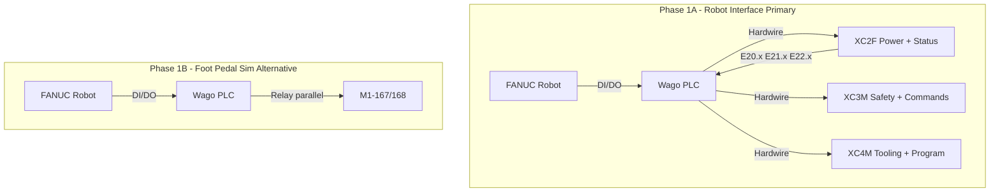

# Physical Wiring Plan Overview

## Purpose

Connect the FANUC robot to the BLM press brake via the Wago PLC using hardwired I/O. **Phase 1A (primary):** XC2F/XC3M/XC4M robot interface connectors — beam-level control. **Phase 1B (alternative):** Foot pedal sim when robot interface unavailable. Modbus TCP is Phase 2 (program load, mode — not beam control).

---

## Architecture

---

## Robot Interface Connectors (Primary — Phase 1A)

**Reference:** [robot_interface_reference.md](robot_interface_reference.md) (BLM ver. 4.0)

### Power (Critical)

| Parameter | Value |
|-----------|-------|
| **24V source** | Press supplies 24V at **XC2F Pin 2** (24 VDC PRESS) |
| **0V reference** | XC2F Pin 1 (0 VDC PRESS) — common for all I/O |
| **Do NOT** | Use robot-side 24V for these signals — press powers robot I/O interface |

### XC2F — Press → Robot (Inputs to PLC)

| Pin | Address | Signal | Purpose |
|-----|---------|--------|---------|
| 3 | E20.0 | Press in Automatic Mode | Machine ready |
| 5 | E20.2 | Beam at UDP | Safe to load/unload |
| 8 | E20.5 | End of Bend | Bend complete, trigger RESET END BEND |
| 9 | E20.6 | Axis in Position | Backgauge ready |
| 16–17 | E21.6 | Press Devices Out of Robot Area | Collision avoidance |

### XC3M — Robot → Press (Outputs from PLC)

| Pin | Address | Signal | Purpose |
|-----|---------|--------|---------|
| 17 | A20.0 | Beam Upwards | Abort/retract beam |
| 18 | A20.1 | Beam Downwards | Initiate bend |
| 19 | A20.4 | Change Bending Step | Advance to next bend |
| 21 | A20.7 | Start from First Bend | New part cycle |
| 22 | A21.0 | Reset Mute Point | Continue past mute |
| 23 | A21.1 | Reset Clamping Point | Continue past CP |
| 24 | A21.2 | Reset End Bend | Command beam retract |

**XC3M Pins 1–16:** Dry contacts (safety) — Enable, Fence, Emergency. See robot_interface_reference.md.

---

## Foot Pedal Sim (Alternative — Phase 1B)

Use when XC2F/XC3M/XC4M connectors are not available.

### PLC Outputs to Press (Robot Triggers)

| Signal | Terminal | Purpose |
|--------|----------|---------|
| **Foot Pedal Sim** | M1-167 or M1-168 | Cycle trigger; wire PLC relay in parallel with KP16.7/KP16.8 |
| Clamping Command | 7A.B6 (via 4-6 rail) | Clamp/unclamp (if used) |
| Robot Cell Clear | Gate/FC14.x or spare | Arm clear (optional) |

### Press Outputs to PLC (Robot Monitors)

| Signal | Source | Purpose |
|--------|--------|---------|
| CNC OK | QW 1.6 | Machine ready, auto mode |
| Ram UP | QW 2.4 | Safe to load/unload |
| Drive OK | IW 0.12 | Y1+Y2 drives healthy |
| Clamping Status | QW 1.13 | Clamping open/engaged |

### Critical Terminals (Phase 1B)

| Terminal | Component | Notes |
|----------|-----------|-------|
| M1-167 | Pedalboard 1 Down NO (KP16.7) | Verify on-site which is active in auto |
| M1-168 | Pedalboard 2 Down NO (KP16.8) | Verify on-site which is active in auto |
| 4-6 (FE4.1 ch 4-6) | 24V Robot Interface rail | 6A max; use for PLC outputs |
| OV4 | 0V reference | All signals 24VDC |

---

## Wiring Summary

- **Phase 1A:** Use 24V from XC2F Pin 2 (press-supplied) for all robot interface signals. Wire gauge 0.5–1.0 mm² (AWG 20–18).
- **Phase 1B:** Foot Pedal Sim — 24V (4-6) through PLC relay NO contact to M1-167 or M1-168.
- **Isolation:** Use relay or opto-isolator between PLC and press.
- **Wire gauge:** 0.5–1.0 mm² (AWG 20–18) typical

---

## On-Site Verification Required

1. **Robot interface:** Confirm XC2F/XC3M/XC4M connectors present on press; verify 24V at XC2F Pin 2
2. **Pedalboard (Phase 1B):** Confirm which circuit (M1-167 vs M1-168) is active in auto mode
3. **External signals:** QW 1.6, QW 2.4, IW 0.12 are internal; robot interface provides E20.x at XC2F
4. **Document:** Record any differences in VENDOR_DISCREPANCIES.md

---

## Reference Files

| File | Purpose |
|------|---------|
| **[robot_interface_reference.md](robot_interface_reference.md)** | **Primary — full signal set, cycle timing, interlock rules** |
| [reference/LDJ_REF_Physical_IO_Wiring_Spec.txt](reference/LDJ_REF_Physical_IO_Wiring_Spec.txt) | Full wiring spec, checklist, verification steps |
| [reference/LDJ_REF_Physical_IO_Terminal_Map.txt](reference/LDJ_REF_Physical_IO_Terminal_Map.txt) | Signal-to-terminal mapping |
| [press_brake_reference.md](press_brake_reference.md) | Electrical diagram (34-page converted) |
| [INTEGRATION_FLOW.md](INTEGRATION_FLOW.md) | PHASE 0-6 cycle (1A), 12-step (1B) |
