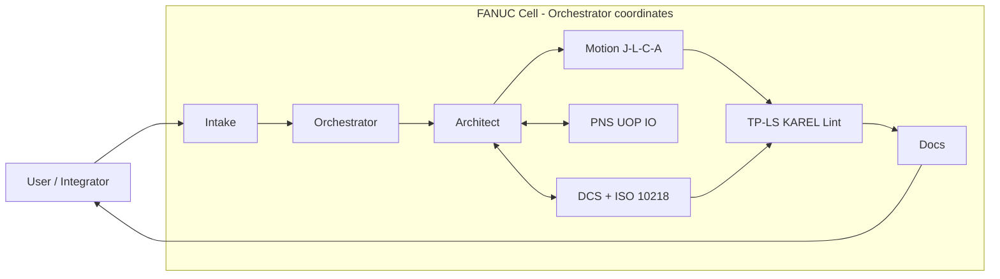

# TeachPendant

An agentic workspace for FANUC industrial robot integration, built by The Way Automation LLC.

TeachPendant is the evolution of the original `FANUC_dev` workspace. Where `FANUC_dev` grew organically out of one integrator's day-to-day notes, TeachPendant is a deliberate, industry-standard scaffold: a multi-agent "robot cell" of Cursor subagents and Claude (Cowork) sessions, coordinated by JSON-schema handoffs, grounded in a normalized FANUC knowledge dataset, and connected to real tools through Model Context Protocol (MCP) servers.

## What it is for

Finish FANUC installations (the active one is LDJ-BLM). Generate, review, and hand off TP/LS and KAREL programs for R-30iB / R-30iB Plus / R-30iB Mate / R-30iB Compact Plus controllers. Keep safety (ISO 10218, ISO/TS 15066, FANUC DCS) as a first-class agent, not an afterthought. Turn a pile of manuals and backups into something a small team can lean on.

## Target platform

- Controllers: FANUC R-30iB, R-30iB Plus, R-30iB Mate, R-30iB Compact Plus.
- System software: V9.x series.
- Languages: TP (teach-pendant `.LS` / `.TP`), KAREL (`.KL` / `.PC`).
- Fieldbus: Profinet, EtherNet/IP (most common FANUC option), DeviceNet, Modbus TCP (gateway), EtherCAT (option).
- Safety: FANUC Dual Check Safety (DCS) - Joint Position Check, Cartesian Position Check, Cartesian Speed Check, Tool Frame.
- Offline: Roboguide (PalletPRO, WeldPRO, HandlingPRO, iRPickTool).
- Integrations: PMC, Background Logic, iRVision, Force Sensor, Socket Messaging, PC SDK, Stream Motion, Ricochet.

## Philosophy

1. **Mimic a real cell.** Agents are roles, not features. Orchestrator = cell PLC. Intake = perception. Architect = task planner. Motion Synthesis = trajectory planner. Integration = I/O / fieldbus. Safety = DCS monitor. QA = diagnostics. Documentation = HMI / operator interface. They confer via schema-validated handoffs.
2. **Dataset is canon. Customer notes are context.** Anything under `fanuc_dataset/normalized/` is the reference truth. Anything under `customer_programs/**/integration_notes/` is customer-scoped reality that may contradict canon - when it does, raise a conflict and defer to the dataset.
3. **Schemas, not screenshots.** Every inter-agent message is validated against a JSON Schema (Draft 2020-12) under `cowork/schemas/`. If it doesn't parse, it doesn't get passed.
4. **MCP everywhere.** Knowledge retrieval, program-repository queries, and safety-lint all run through local MCP servers, so both Cursor and Claude Desktop see the same ground truth through the same API.
5. **Safety is deterministic.** `fanuc_safety_lint` is a rule engine, not an LLM. It either finds a `WAIT DI[]` without a timeout or it doesn't.
6. **Evolvable.** New customers, new controllers, new knowledge just land in the right folder. No rule edits required to keep working.

## Layout

```text
TeachPendant/
  AGENTS.md                            # master instructions (Cursor + Cowork read this)
  CLAUDE.md                            # Cowork-specific orchestration doc
  README.md                            # this file
  SETUP.md                             # step-by-step bootstrap for a fresh clone
  MIGRATION_LOG.md                     # what came from FANUC_dev and how it was transformed
  LICENSE
  .cursor/
    rules/                             # glob-scoped Cursor rules (.mdc)
    skills/                            # Cursor skills (SKILL.md format)
    agents/                            # per-role agent system prompts
  cowork/
    templates/                         # markdown templates agents emit
    schemas/                           # JSON Schemas for every handoff
    workflows/                         # multi-agent interaction scripts
  fanuc_dataset/
    normalized/{articles,reference,examples,protocols,safety}/
    raw_sources/                       # PDFs, LFS-tracked, .cursorignored
    DATASET_INDEX.md
    DATASET_README.md
    INGESTION_SCHEMA.md
    _manifest.json
  customer_programs/
    PROGRAM_REPOSITORY_INDEX.md
    _manifest.json
    ldj_blm/                           # flagship customer; see customer_programs/ldj_blm/README.md
    308_gh/ 313_jd/ 345_pj/            # placeholders
  mcp_servers/
    fanuc_knowledge/                   # RAG over fanuc_dataset/normalized/
    program_repository/                # queries over customer_programs/
    fanuc_safety_lint/                 # static safety + convention linter
    mcp.example.json
  ros2/src/                            # fanuc_driver, fanuc_description (migrated from physical_ai/)
  tools/mqtt_bridge/                   # press-brake MQTT bridge (migrated from FANUC_dev)
  evals/
    runner.py
    cases/ golden/
  research/
    RESEARCH_PROMPT_FANUC.md
    RESEARCH_TRACKING.md
```

## The agent cell



Every solid edge is a JSON-schema-validated handoff. The Orchestrator maintains `task_state.json` as a shared blackboard.

## Getting started

See [SETUP.md](SETUP.md) for the full copy-out, install, and register flow.

TL;DR:

1. Copy this folder out of `FANUC_dev/` into its own location.
2. `git init`, `git lfs install`.
3. Drop FANUC PDFs under `fanuc_dataset/raw_sources/` (don't publish these publicly).
4. Install the three MCP servers under `mcp_servers/` and register them in Cursor + Claude Desktop.
5. Open `teachpendant.code-workspace` in Cursor.
6. Run the `ingest-pdf-to-normalized` skill to populate the dataset.
7. Run the deep-research prompt in `research/` to fill gaps.
8. For LDJ-BLM specifically, follow `cowork/workflows/ldj_blm_continuation.md`.

## What this is not

- Not a runtime orchestrator. Cursor + Claude Desktop + MCP are the runtime. No Docker. No persistent DB. No Python service to maintain.
- Not an execution environment. FANUC programs run on FANUC controllers. TeachPendant authors them, reviews them, and documents them.
- Not a redistribution channel for FANUC proprietary documentation. Raw PDFs stay local. Normalized entries cite, summarize, and link; they never reproduce manuals.

## Evolution from FANUC_dev

TeachPendant is a clean rebuild. `FANUC_dev` content has been ported and re-integrated, not merely moved:

- The old `FANUC_Optimized_Dataset/optimized_dataset/` has been re-parsed into `fanuc_dataset/normalized/` with schema-validated frontmatter.
- The top-level `LDJ/` folder (integration notes, press-brake docs, BLM manuals) has been **relocated** under `customer_programs/ldj_blm/integration_notes/` and **de-canonized** (marked `canonical: false`) because it is customer-specific and the integration plan is still evolving. Generalizable content (press-brake Modbus reference, FANUC robot interface reference) has been promoted into `fanuc_dataset/normalized/protocols/` after customer-identifier scrubbing.
- `physical_ai/` (the ROS 2 driver) moved to `ros2/src/`.
- `mqtt_bridge/` moved to `tools/mqtt_bridge/`.
- All moves are logged with before/after paths in [MIGRATION_LOG.md](MIGRATION_LOG.md).

## Credit

Built inside Cursor + Claude Desktop for The Way Automation LLC. Mirrors the architecture of the sibling `KUKA_Agentic_Workspace_Template/` so that integrators who work across brands can lift and shift their mental model.
