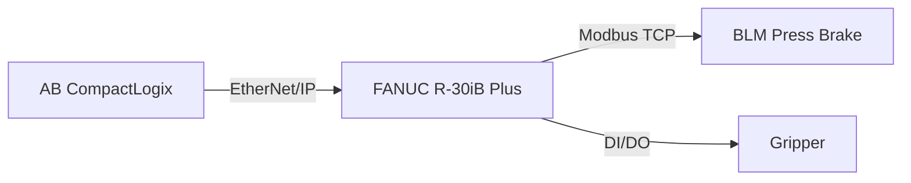
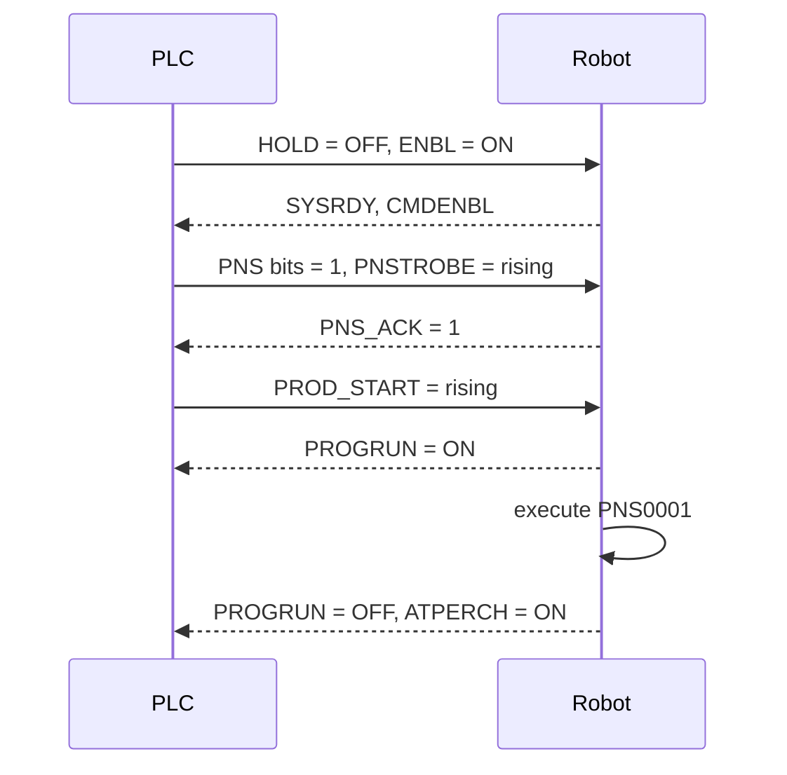

---
# Informational template; frontmatter is descriptive, no dedicated schema (uses program_spec related field)
schema: integration_spec
task_id: <uuid>
customer_id: <customer>
program_name: <NAME>
fanuc_controller: [R-30iB Plus]
fieldbus:
  primary: ethernet_ip | profinet | devicenet | modbus_tcp | ethercat
  masters: [<PLC name / model>]
  slaves: [<other nodes>]
handshake: pns | style_select | rsr | custom
groups: [1]
author: integration
created_at: <ISO 8601>
status: draft | approved
---

# Integration Spec: <NAME>

## Summary

One paragraph naming the external partner(s), the primary fieldbus, the program-select pattern, and the critical handshakes.

## Topology

## UOP Map

Which UOP signals the PLC drives:

| UOP | Index | Dir | Meaning | PLC tag |
|-----|-------|-----|---------|---------|
| IMSTP | UI[1] | In | Immediate stop | `Robot.IMSTP` |
| HOLD | UI[2] | In | Pause | `Robot.HOLD` |
| ... | ... | ... | ... | ... |

## PNS Map (if PNS handshake)

| PNS number | Program | Trigger |
|-----------|---------|---------|
| 1 | `PNS0001.LS` | PLC sets UI[9]=1, strobes UI[17] |
| 2 | `PNS0002.LS` | ... |

## Signal Aliases

Full DI/DO table with aliases, comments, and PLC tag mapping:

| Type | Index | Alias (on robot) | Purpose | PLC tag |
|------|-------|------------------|---------|---------|
| DI | 101 | PB_START | Press-brake cycle complete | `PressBrake.Done` |
| DI | 102 | PB_FAULT | Press-brake fault | `PressBrake.Fault` |
| DO | 45 | GRIP_CLOSE | Close gripper | - |
| DO | 46 | GRIP_OPEN | Open gripper | - |

## Group I/O

| Group | Indices | Bit ordering | Meaning |
|-------|---------|--------------|---------|
| `GI[1]` | DI[121..128] | LSB=DI[121] | Part style ID (0-255) |
| `GO[1]` | DO[121..128] | LSB=DO[121] | Error code to PLC |

## Safe I/O

If any safe I/O is used, document here plus its safety function:

| Type | Index | Name | Safety Function |
|------|-------|------|-----------------|
| SI | 1 | GUARD_CLOSED | Gate monitoring - input to JPC enable |

## Handshake Sequence

Prose + mermaid sequence diagram for non-trivial handshakes:

## Local Conventions (customer-specific deviations from canon)

- <Example: LDJ-BLM uses `GI[2]` for style code rather than the canonical `GI[1]` per integrator history.>

## Open Questions

- <List items requiring clarification with the customer or the PLC integrator.>
