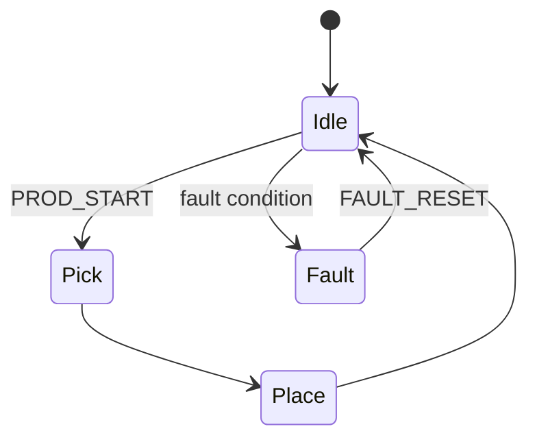

---
# Validates against cowork/schemas/program_spec.schema.json
schema: program_spec
task_id: <uuid>
customer_id: <customer>
system: <system>
program_name: <UPPERCASE_NAME>
program_kind: tp_main | tp_subprog | karel | bg_logic | cond_program | error_handler
fanuc_controller: [R-30iB, R-30iB Plus]   # or Mate / Compact Plus
system_sw_version: [V9.30]                 # adjust
language: TP                               # TP | KAREL | mixed
groups: [1]
created_by: architect
created_at: <ISO 8601>
status: draft                              # draft | in_review | approved | superseded
related:
  program_intake: <path to intake envelope>
  integration_spec: <path to INTEGRATION_SPEC_*.md>
  safety_review: <path to SAFETY_REVIEW_*.md>
citations:
  - FANUC_REF_<entry_id>
---

# Program Spec: <NAME>

## Summary

Two to four sentences. What this program is, where it runs in the cell's sequence, what calls it and what it calls.

## State Machine

Text description plus, if non-trivial, a mermaid diagram:

## Preconditions

- DCS: <zones that must be active>
- Fieldbus: <required link status>
- UOP: ENBL, CMDENBL, SYSRDY steady high; no active faults
- Operator: <required operator actions, if any>
- Tool: `UTOOL_NUM=<n>`, `UFRAME_NUM=<n>`
- Registers: `R[<n>:NAME]` initialized to `<value>`

## Postconditions

- Expected output registers / group signals.
- Expected robot position (`PR[<n>:HOME]` or similar).
- Expected cycle counter increment.

## I/O Contract

Reference `INTEGRATION_SPEC_<NAME>.md` for the full table. Required signals:

| Direction | Signal | Purpose |
|-----------|--------|---------|
| In | `DI[<n>:NAME]` | ... |
| Out | `DO[<n>:NAME]` | ... |
| In | `UI[18] PROD_START` | start trigger |
| Out | `UO[7] ATPERCH` | home indicator |

## Safety Envelope

Reference `SAFETY_REVIEW_<NAME>.md`. Required DCS functions:

- Cartesian Position Check: <zone IDs>
- Cartesian Speed Check: <limit mm/s>
- Joint Position Check: <limits>
- Tool Frame: <validated tool IDs>

## Motion Skeleton

Named points (to be taught), speed buckets, termination style:

| Point | Type | Purpose | Speed | Termination |
|-------|------|---------|-------|-------------|
| `PR[1:HOME]` | joint | safe perch | 100% | FINE |
| `PR[2:PICK_APPROACH]` | linear | above pick | 500 mm/s | CNT50 |
| `PR[3:PICK_DOWN]` | linear | pick work point | 200 mm/s | FINE |
| `PR[4:PICK_RETRACT]` | linear | retract after pick | 500 mm/s | CNT50 |

## Subroutines

- `PICK.LS` - grip sequence.
- `PLACE.LS` - release sequence.
- `HOME.LS` - return to perch.

## Error Recovery

Named alarms and their handlers:

| UALM ID | Name | Condition | Handler |
|---------|------|-----------|---------|
| 1 | `PB_START_TIMEOUT` | `WAIT DI[...:PB_START]=ON` timed out | `LBL[99]` - park, clear, retry |
| 2 | `GRIPPER_FAULT` | `DI[...:GRIP_FAULT]=ON` | `LBL[98]` - abort cycle |

## Acceptance Tests

Numbered, observable tests the installer or QA runs on hardware:

1. With robot at `PR[1:HOME]`, assert PROD_START; verify `UO[3] PROGRUN = ON` within 500 ms.
2. Verify `PR[2]` through `PR[4]` taught and motion completes within <cycle-time budget> seconds.
3. Force `DI[<PB_START>]=OFF` mid-cycle; verify `UALM[1]` raised, robot parked, `DO[<ABORT>]=ON`.
4. ...

## Open Questions

Any point the Architect couldn't resolve from canon + customer context. Each gets routed to Research or the human.

## Sign-off

- Architect: <name / date>
- Integration: <name / date>
- Safety: <name / date>
- QA: <name / date, after review>
