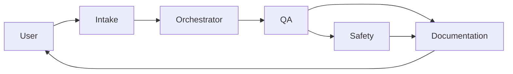

# Workflow: Code Review

Review an existing TP/LS or KAREL program without producing a new one. Output is findings + actionable fixes.

## Trigger

User supplies a program or a revision pair: "Review our PNS0001 for LDJ-BLM", "Did the 041626 backup introduce any regressions?"

## Agents and order

## Stages

### 1. Intake

- Identify customer, file paths, revision range.
- Produce `program_intake` with `task_type: code_review`.

### 2. QA

- Run `fanuc_safety_lint.lint_ls` / `.lint_karel` on every file.
- Diff against prior revision via `program_repository.diff` if a range is specified.
- Check citations in any accompanying spec docs.
- Produce `QA_REVIEW_<NAME>.md`.

### 3. Safety

- Review any findings flagged as safety-relevant.
- Cross-check DCS spec against the program's motion.
- Produce `SAFETY_REVIEW_<NAME>.md` (may be a short "safety-delta" review, not full).

### 4. Documentation

- Author a `REVIEW_SUMMARY_<NAME>.md`: executive summary, top-N findings with fixes, comparison to prior revision.
- Update `customer_programs/<c>/lint_baseline.md` if findings materially changed.

## Exit criteria

- `QA_REVIEW` and `SAFETY_REVIEW` both present.
- `REVIEW_SUMMARY` exists.
- Any `critical` finding escalated to human before close.
