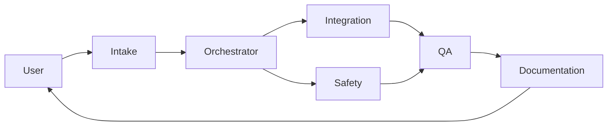

# Workflow: Customer Onboarding

Add a new customer to TeachPendant. Set up the directory, pull in existing backups, capture controller config, establish a lint baseline.

## Trigger

User: "We have a new customer <name>; let's start tracking them." OR: an existing customer whose programs haven't landed yet gets assigned their first task.

## Agents and order

## Stages

### 1. Intake

- Customer: name, ID (used as folder name), industry, contact.
- Systems at the customer: robot model(s), controller(s), V9.x version(s), fieldbus, collaborative?
- Existing artifacts: backups available? drawings? integration docs? safety config?

### 2. Orchestrator

- Create `customer_programs/<customer_id>/` with:
  - `README.md` from the Integration/Safety outputs below.
  - `backups/<YYYYMMDD>/` populated with supplied backups.
  - `current/` initialized from the latest backup.
  - `integration_notes/` empty at first, populated as docs are collected.
  - `integration_notes/raw_docs/` empty at first.
- Add an entry to `customer_programs/_manifest.json`.

### 3. Integration (initial pass)

- Read any available backup of system data / I/O configuration.
- Author an initial `INTEGRATION_SPEC_<customer_id>.md` capturing: fieldbus primary, UOP map used, signal aliases extracted from the backup's `DIOCFGSV.IO` etc.
- Flag unknowns.

### 4. Safety (initial pass)

- Read any available DCS configuration backup (`SYSMAST.SV` / safety parameter backup).
- Author an initial `SAFETY_REVIEW_<customer_id>_BASELINE.md` with the DCS spec as-shipped, marked verdict `informational` (it's a baseline, not an approval).
- Note any gaps (DCS not configured, unknown zones, etc.).

### 5. QA

- Run `fanuc_safety_lint.lint_ls` against every `.LS` in the initial backup.
- Produce `customer_programs/<customer_id>/lint_baseline.md` - baseline findings, severity summary.
- Note conventions: any systematic deviations from canon (e.g., customer uses `PR[90+]` range instead of `PR[1..30]`) go to `README.md` "Local conventions".

### 6. Documentation

- Finalize `customer_programs/<customer_id>/README.md`:
  - Controller model and V9.x version.
  - Fieldbus.
  - DCS summary.
  - Lint baseline summary.
  - Open work items.
  - Contact.
  - Local conventions.
- Update `customer_programs/PROGRAM_REPOSITORY_INDEX.md` with a row for the new customer.

## Exit criteria

- `customer_programs/<customer_id>/` exists with non-empty README, manifest entry, lint baseline.
- Any baseline safety concerns are raised to the user before closing.
