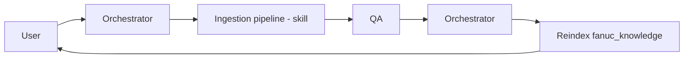

# Workflow: Knowledge Ingestion

Turn new raw source material (PDFs, research findings, field notes) into normalized dataset entries.

## Trigger

- New PDFs land under `fanuc_dataset/raw_sources/`.
- The research prompt emits findings under `research/findings/`.
- A customer-specific integration note is flagged for promotion.
- An agent raised a gap ticket during a task.

## Agents and order

## Stages

### 1. Orchestrator

- Enumerate new raw material.
- Plan the batch: list of entries to produce, target subdirectories, rough estimate.

### 2. Ingestion Pipeline (skill: `ingest-pdf-to-normalized`)

- Execute the skill steps: extract, chunk, author frontmatter, copyright-scrub.
- Output new `.md` files under `fanuc_dataset/normalized/<kind>/`.
- Update `_manifest.json` and `DATASET_INDEX.md`.

### 3. QA

- Validate frontmatter against `dataset_entry.schema.json`.
- Spot-check citations: every non-trivial claim has `source:` or `source_urls`.
- For safety-category entries, verify they landed under `normalized/safety/`.
- Reject anything without T1/T2 citation for a non-trivial claim (or lacking two concurring T3/T4).

### 4. Orchestrator

- Call `fanuc_knowledge.reindex`.
- Update `research/RESEARCH_TRACKING.md` (mark taxonomy nodes covered).

## Integration-note promotion path

When a customer integration note contains content that is actually generalizable:

1. Intake flags the candidate content.
2. Ingestion skill takes the candidate as raw input, scrubs customer identifiers, rewrites with citations to canonical sources, emits a new `fanuc_dataset/normalized/protocols/ONE_*.md`.
3. QA validates.
4. The customer-scoped remainder stays under `customer_programs/<c>/integration_notes/` with a `supersedes:` pointer to the new canon entry.

## Exit criteria

- New entries in place, `_manifest.json` and `DATASET_INDEX.md` updated.
- All QA validations pass.
- `fanuc_knowledge.reindex` succeeded.
- `research/RESEARCH_TRACKING.md` reflects the new coverage.
