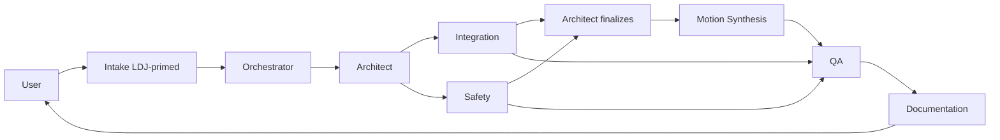

# Workflow: LDJ-BLM Installation Continuation

Flagship customer. This workflow picks up the LDJ-BLM press-brake + FANUC cell installation from its current state and drives it to completion.

## Why a dedicated workflow

LDJ-BLM has more accumulated customer context than a typical engagement, and the installation plan is still evolving. A generic program_generation workflow would lose the press-brake Modbus specifics, the ESA controller conventions, and the customer's local convention history. This workflow wraps the generic flow with LDJ-specific priming.

## Trigger

- User says "work on LDJ", "continue BLM installation", "press brake", "finish LDJ-BLM".
- Scheduled follow-up after a site visit.

## Agents and order

## Stages

### 1. Intake (LDJ-primed)

In addition to the generic Intake behavior:

- Read `customer_programs/ldj_blm/README.md`.
- Read `customer_programs/ldj_blm/lint_baseline.md` (so new work doesn't regress).
- List every file under `customer_programs/ldj_blm/integration_notes/` (titles + status only, not full content).
- Pull the latest DCS summary and fieldbus section from `README.md`.
- Produce intake with `task_type: modification` (or `new_program` if a net-new program) and `customer_id: ldj_blm`.

### 2. Orchestrator

- Snapshot `customer_programs/ldj_blm/current/` to `customer_programs/ldj_blm/backups/<YYYYMMDD>-preedit/` BEFORE any write.
- Dispatch Architect.

### 3. Architect

- Same as generic, with two extra obligations:
  - Cite `fanuc_dataset/normalized/protocols/ONE_press_brake_modbus_integration.md` for any press-brake I/O claim.
  - When customer integration notes appear to contradict canon, raise the conflict explicitly and defer to canon.

### 4. Integration

- Use the already-existing `INTEGRATION_SPEC` for LDJ-BLM if one is in place under `customer_programs/ldj_blm/` (the migration should have produced one).
- New I/O goes in the existing table, not a separate one.
- Modbus-TCP side: reference `tools/mqtt_bridge/` if the gateway pattern is used for the press brake.

### 5. Safety

- DCS review is mandatory on every LDJ-BLM change. Re-read the current DCS spec; re-verify the changed program's motion fits within the envelope.
- Press-brake proximity is a recurring risk; document pinch-point analysis in the safety review.
- Verify the E-stop / guard behavior in fault recovery path.

### 6. Motion Synthesis

- Follow the LDJ local convention (captured in `customer_programs/ldj_blm/README.md` "Local conventions").
- Preserve customer naming: `PNS0001.LS`, `BG_LOGIC.LS`, `-BCKED*-.LS` patterns.

### 7. QA

- Lint every changed file.
- Diff against the latest backup revision.
- Ensure the new lint output is a subset of (or better than) `lint_baseline.md`; any regression blocks handoff.

### 8. Documentation

- Update `customer_programs/ldj_blm/README.md`:
  - Open work items ticked off.
  - New DCS summary if changed.
  - Reference the new installation notes doc.
- Emit `INSTALLATION_NOTES_<DATE>.md` under `customer_programs/ldj_blm/docs/`.
- Update `CHANGE_LOG.md` under the same directory.

## Completion Criteria for the Overall Installation

The LDJ-BLM installation is "finished" when:

- [ ] DCS is fully specified in `SAFETY_REVIEW_ldj_blm_AUDIT_*.md` with all zones tested on hardware.
- [ ] PNS handshake validated end-to-end with the customer's PLC (or cell master).
- [ ] Press-brake Modbus integration tested through `tools/mqtt_bridge/` (or direct KAREL socket) - startup, steady, fault, recovery.
- [ ] All `customer_programs/ldj_blm/current/*.LS` lint at zero `critical` and `high` findings.
- [ ] Operator guide and installation notes exist and are signed off by the user.
- [ ] Acceptance tests from each `PROGRAM_SPEC_*.md` have been run on hardware with green checkmarks.
- [ ] `customer_programs/ldj_blm/README.md` "Open Work" list is empty.

Track these in `customer_programs/ldj_blm/README.md` as a master checklist.

## Non-negotiables

- Never edit a backup file. Always copy forward into `current/` first.
- Never let an integration note override a canonical safety claim.
- Always snapshot `current/` to `backups/<YYYYMMDD>-preedit/` BEFORE the first write in a session.
- Always run `fanuc_safety_lint` and compare to baseline before claiming done.
