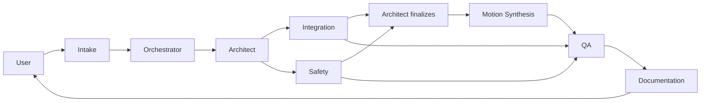

# Workflow: Program Generation

End-to-end script for generating a new FANUC TP/LS or KAREL program for an existing customer.

## Trigger

User asks for a new program: "Write a PNS for LDJ-BLM style-3 parts", "Add a KAREL socket server for the ESA controller", etc.

## Agents and order

## Stages

### 1. Intake

- Read user message.
- Call `program_repository.list_customers` + `program_repository.get_integration_notes(<customer>)` if customer named.
- Call `fanuc_knowledge.search` for any unknown domain terms.
- Produce `program_intake` envelope. Schema: `program_intake.schema.json`.

### 2. Architect (draft)

- Read intake.
- Search dataset for analogous program patterns.
- Draft `PROGRAM_SPEC_<NAME>.md` with state machine, preconditions, motion skeleton, error recovery, acceptance tests.
- Flag unknowns as "open questions" and dispatch Integration + Safety in parallel.

### 3. Integration

- Produce `INTEGRATION_SPEC_<NAME>.md`: UOP map, signal aliases, group I/O, handshake sequence.
- Cite canon for every UOP/PNS claim.
- Return to Architect with the I/O contract or conflicts.

### 4. Safety

- Produce `SAFETY_REVIEW_<NAME>.md` (draft): DCS spec, standards applied, collaborative analysis if applicable.
- Grade severities. If critical is found, block the workflow.
- Return to Architect with recommendations or conflicts.

### 5. Architect (finalize)

- Merge Integration + Safety outputs into the program spec.
- Resolve open questions; any remaining go to the Orchestrator for adjudication or escalation.
- Status: `status: approved`.

### 6. Motion Synthesis

- Read finalized spec + safety review.
- Emit `.LS` / `.KL` source under `customer_programs/<c>/current/`.
- Self-lint with `fanuc_safety_lint`; resolve all `high+` before handoff.
- Hand off to QA.

### 7. QA

- Validate all frontmatter.
- Run `fanuc_safety_lint` once more.
- Diff against any prior revision.
- Verify citations resolve.
- Produce `QA_REVIEW_<NAME>.md`.
- If any `high+` open, kick back to Motion (or the originating agent).

### 8. Documentation

- Author `OPERATOR_GUIDE_<NAME>.md` and `INSTALLATION_NOTES_<NAME>.md`.
- Update `customer_programs/<c>/README.md` (next steps, current status).
- Emit terminal handoff.
- Orchestrator sets `task_state.status = done`.

## Retry and escalation

- Any QA or Safety `critical` -> `task_state.status = blocked`, human escalation.
- Any two-way conflict the Orchestrator can't resolve via canon -> human escalation.
- Motion produces source with unresolved `UNTESTED` coordinates -> acceptable, but tracked in `task_state.documentation` as a hardware-test-pending item.

## Exit criteria

- All agents have a record in `task_state.handoffs[]`.
- `QA_REVIEW` verdict is `pass` or `pass_with_conditions` with signoff.
- `SAFETY_REVIEW` verdict is `pass` or `pass_with_conditions` with signoff.
- Documentation artifacts exist on disk.
- `customer_programs/<c>/README.md` reflects the change.
