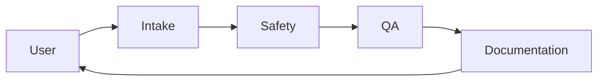

# Workflow: Safety Audit

Audit an existing cell or program against ISO 10218, ISO/TS 15066 (if collaborative), and FANUC DCS best practices. Independent of any new-program task.

## Trigger

- Annual / pre-production safety check.
- User asks for a safety posture report.
- A near-miss or incident triggers a re-audit.

## Agents and order

## Stages

### 1. Intake

- Scope: which customer / cell / program set.
- Standards applied: always ISO 10218 + FANUC DCS; add ISO/TS 15066 if any collaborative mode.
- Inputs: controller config backup, DCS parameter backup, program backups, `customer_programs/<c>/integration_notes/`.

### 2. Safety

- Enumerate DCS functions configured on the controller vs what the programs require.
- For each program, cross-check motion against DCS envelope.
- For collaborative cells, run PFL body-region analysis per ISO/TS 15066 Table A.2; compute transient and quasi-static contact limits; cite entries.
- Produce `SAFETY_REVIEW_<customer>_AUDIT_<YYYYMMDD>.md`.
- Grade severities. Any `critical` halts the cell (user-escalation language in the doc).

### 3. QA

- Cross-check Safety's findings against the lint baseline and dataset.
- Verify every finding has a normative reference.
- Verify the DCS spec table is complete (no empty fields).

### 4. Documentation

- Author an audit summary (exec summary + findings + required actions).
- Update `customer_programs/<c>/README.md` DCS summary and next steps.

## Exit criteria

- Safety review is complete with severity grading and normative references.
- Every `critical` has a human signoff or a documented remediation plan with owner and date.
- Audit summary doc exists.
