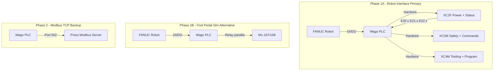

---
scope: customer_specific
customer: ldj_blm
canonical: false
status: evolving
supersedes: FANUC_dev/LDJ/LDJ_Controls_Engineer_Overview.md
source:
  type: onsite_notes
  acquired_from: The Way Automation LLC
  acquired_date: "2026-04-22"
---

# LDJ Controls Engineer Overview

> CONTEXT, NOT CANON. This is customer-specific integration material. If it contradicts `fanuc_dataset/normalized/`, canon wins. Raise conflicts under `task_state.conflicts[]`.
# BLM Press Brake + FANUC Robot Integration — Controls Engineer Overview

**Document:** Master overview for controls engineer  
**Purpose:** Complete integration reference for hardwire and Modbus TCP  
**Machine:** BLM SERIES 420-200, ESA/Kvara  
**Date:** 2025

---

## 1. Project Context

- **Integration:** BLM press brake + FANUC robot for automated bending
- **Robot package:** Not purchased from BLM — custom integration via hardwire and Modbus TCP
- **Approach:** Hardwire (primary) + Modbus TCP (backup for program load, mode, parameters)
- **Phases:**
  - **Phase 1A (Primary):** XC2F/XC3M/XC4M robot interface — beam-level control
  - **Phase 1B (Alternative):** Foot pedal sim (M1-167/168) when robot interface connectors unavailable
  - **Phase 2:** Modbus TCP — program load, mode selection, parameter edits — **not beam control**

---

## 2. Architecture Summary



### Signal Flow Summary

| Phase | Source | Destination | Method | Purpose |
|-------|--------|-------------|--------|---------|
| 1A | Press | PLC | XC2F (E20.x, E21.x, E22.x) | Beam position, axis status, finger sensors |
| 1A | PLC | Press | XC3M (A20.x, A21.x) | Beam Up/Down, Change Step, Reset Mute/CP/End Bend |
| 1B | PLC | Press | M1-167/168 | Foot pedal sim — trigger bend |
| 1B | Press | PLC | QW 1.6, QW 2.4, IW 0.12 | CNC OK, Ram UP, Drive OK |
| 2 | PLC | Press | Modbus TCP | Program load, mode, parameters |
| 2 | Press | PLC | Modbus TCP | Ack, error, status |

---

## 3. Full Robot Cycle (PHASE 0–6)

From BLM Press-Brake Interface ver. 4.0 (robot_interface_reference.md).

### PHASE 0 — Startup / First Bend Initialization

**Preconditions:** E20.0 (Auto), E22.0/22.1 (Die/Punch clamped), E21.6 (Devices clear), Enable closed (XC3M 9–12), Fence closed (XC3M 13–16), no emergency

**Robot actions:**
- Send A20.7 HIGH (START FROM FIRST BEND)
- Wait for E21.4 HIGH (FIRST BEND ACTIVE)
- Send A22.4 HIGH (AUTOMATIC MODE SELECTION)
- Confirm E20.0 HIGH (PRESS IN AUTOMATIC MODE)

### PHASE 1 — Part Positioning (Load to Back Gauge)

**Preconditions:** E20.2 (UDP), E20.6 (Axis in Position), E21.6 (Devices Clear)

**Robot actions:**
- Enter press zone, present part to back gauge fingers
- Wait E21.0–E21.3 (finger sensors) — all assigned must be HIGH
- Release gripper, clear to safe position

### PHASE 2 — Bend (Mute, CP, LDP, RESET END BEND)

**Initiate descent:**
- A20.1 HIGH (BEAM DOWNWARDS)
- A21.0 HIGH (RESET MUTE POINT) — pre-send to avoid pause
- A21.1 HIGH (RESET CLAMPING POINT) — pre-send to avoid pause

**Sequence:** Fast descent → Mute (E20.1) → Slow descent → CP (E20.3) → Bending → LDP (E20.4) → End of Bend (E20.5) → Angle OK (E20.7 if used)

**Robot:** Wait E20.5 + E20.7 (if angle device) → A21.2 HIGH (RESET END BEND) → beam retracts → wait E20.2 (UDP)

### PHASE 3 — Change Bending Step

- A20.4 HIGH (CHANGE BENDING STEP) — after E20.5 was HIGH and RESET END BEND sent
- Wait E20.6 (Axis in Position)
- Reposition part, A20.4 LOW

### PHASE 4–5 — Additional Bends

Same as Phase 2; with or without mute point; with or without angle control per step.

### PHASE 6 — Part Unload

- Wait E20.2 (UDP)
- Enter, grip finished part, remove
- A20.7 (START FROM FIRST BEND) or A20.4 (CHANGE STEP) or A22.3 (EDITING MODE) for program change

### Critical Interlock Rules

**Before Beam Down (A20.1):**
- E20.0 HIGH, E21.6 HIGH
- XC3M Pins 9–12 CLOSED (Enable)
- XC3M Pins 1–4 CLOSED (No press emergency)

**Before entering press zone:** E20.2 (UDP), E20.6 (Axis in Position), E21.6 (Devices Clear)

**Before RESET END BEND (A21.2):** E20.5 (End of Bend) + E20.7 (Angle OK, if angle device active)

**Release part before:** E20.3 (Clamping Point)

---

## 4. Hardwire Integration (Phase 1A)

### Connectors

| Connector | Function | Part Numbers |
|-----------|----------|--------------|
| XC2F | Power + Status I/O | Weidmüller 1745850000 + 121240000 |
| XC3M | Safety + Commands | Weidmüller 1745790000 + 121240000 |
| XC4M | Tooling + Program | Weidmüller 1745780000 + 1208600000 |

### Power

- **24V:** Press supplies at XC2F Pin 2 (24 VDC PRESS)
- **0V:** XC2F Pin 1 (0 VDC PRESS) — common for all I/O
- **Do NOT** use robot-side 24V for these signals

### Key Signals

| Signal | Address | Connector | Purpose |
|--------|---------|-----------|---------|
| Beam at UDP | E20.2 | XC2F P5 | Safe to load/unload |
| End of Bend | E20.5 | XC2F P8 | Bend complete |
| Beam Downwards | A20.1 | XC3M P18 | Initiate bend |
| Reset End Bend | A21.2 | XC3M P24 | Command beam retract |
| Change Bending Step | A20.4 | XC3M P19 | Next bend |
| Start from First Bend | A20.7 | XC3M P21 | New part cycle |

See **01_robot_interface_reference.md** and **reference/LDJ_REF_Physical_IO_Terminal_Map.txt** for full pin mapping.

---

## 5. Modbus TCP Integration

### 5.1 What Modbus Can Do

| Function | Opcode/Register | Notes |
|----------|-----------------|-------|
| Load program | COMMAND_LOAD_PROG (3030) | Reg 2 or 53 for program name |
| Change mode | Reg 0 (BIT0=Editor, BIT3=Auto) | Wait Reg 1226 for ack |
| Start cycle | COMMAND_START (3008) | Requires Auto mode |
| Next bend | COMMAND_NEXT (3013) | Advance to next step |
| Prev bend | COMMAND_PREV (3014) | Return to previous step |
| Modify parameters | 1006 (thickness), 1009 (angle), etc. | Editor mode required |
| Read status | Reg 1227 (mode), 1024 (error), 1253+ (bend data) | Poll only |

### 5.2 Step-by-Step: Getting Modbus Up and Working

1. **Network configuration**
   - Press IP: 172.16.0.51 (typical)
   - PLC IP: 172.16.0.50 (typical)
   - Port: 502 (Modbus TCP)
   - Unit ID: 1
   - Ensure PLC and press on same subnet; verify with `ping`

2. **Enable Modbus on press**
   - ESA/Kvara Modbus server runs when press CNC is powered
   - Verify in ESA diagnostics if available; server may bind to localhost by default

3. **Modify ServerModbus.xml** (see 5.3)

4. **Restart ESA/Kvara** after config changes

5. **Test connectivity** (see 5.4)

### 5.3 Modifying Files on the Press Brake

**File:** `Kvara/Exe/ServerModbus.xml` (or equivalent path on press HMI/controller)

**Change:** Default `<IPAddr>127.0.0.1</IPAddr>` binds to localhost only. To accept external connections:
- Option A: `<IPAddr>0.0.0.0</IPAddr>` — listen on all interfaces
- Option B: `<IPAddr>172.16.0.51</IPAddr>` — bind to specific NIC

**Backup:** Always backup before editing.

**Location:** Typically on press controller (ESA touch panel or embedded PC). Access may require OEM support or service mode.

**Vendor discrepancy:** Program name at Reg 2 (80 regs) per ServerModbus.xml vs Reg 53 (40 regs) in Quick_Reference — verify on your machine. See reference/VENDOR_DISCREPANCIES.md.

### 5.4 Testing Modbus

**Quick Start:**
1. Install Modbus client (e.g., Modbus Poll, or Python: `pip install pymodbus`)
2. Set target: 172.16.0.51, port 502, Unit ID 1
3. Read holding register 1227 (1 register) — Active Operating Mode (0–3)
4. If connection fails: check ServerModbus.xml IPAddr; ensure firewall allows 502; verify press Modbus server is running

**Test sequence:**
1. **Connectivity:** Read Reg 1227 — should return 0–3
2. **Mode:** Write 1 to Reg 0 (Editor); poll Reg 1226 until BIT0=1; write 0; poll until clear
3. **Load program:** Write program name to Reg 2 (or 53); write 3030 to Reg 2; write 1 to Reg 1 (strobe); poll Reg 1231 until BIT0=1; write 0 to Reg 1; poll Reg 1231 until BIT0=0; read Reg 1024 (should be 0)
4. **Start (Auto mode):** Write 8 to Reg 0 (BIT3=Auto); wait mode ack; write 3008 to Reg 2; strobe; wait ack. **Note:** Robot must use hardwire Ram UP for safe entry — Modbus alone cannot confirm safe zone.

### 5.5 Modbus vs Hardwire: Back-and-Forth Communications

**Hardwire (full cycle) — real-time, sub-millisecond:**

```
Robot                    PLC                      Press (XC2F/XC3M)
─────                    ───                      ─────────────────
                         ← E20.2 (UDP)            Status: beam at top
WAIT DI[udp]             
                         → A20.1, A21.0, A21.1    Commands: beam down, reset mute/CP
                         ← E20.5 (End of Bend)    Status: bend complete
                         → A21.2                  Command: reset end bend
                         ← E20.2 (UDP)            Status: beam retracted
```

**Modbus (program load) — request/response, 50–500ms per exchange:**

```
PLC                      Press (Modbus Server)
───                      ─────────────────────
Write Reg 0 = 1          Mode request: Editor
Poll Reg 1226 BIT0=1     Mode ack
Write Reg 2 = "PART_A"   Program name
Write Reg 2 = 3030       Load program opcode
Write Reg 1 = 1          Strobe
Poll Reg 1231 BIT0=1     Command ack (100ms–2s typical)
Write Reg 1 = 0          Clear strobe
Poll Reg 1024 = 0        Error check
```

**Modbus (COMMAND_START — foot-pedal equivalent):**

```
PLC                      Press
───                      ─────
Write Reg 0 = 8          Auto mode
Write Reg 2 = 3008       COMMAND_START
Strobe Reg 1
Wait Reg 1231
```

Press may run full bend cycle without stops. No way to know when UDP reached; robot must use hardwire Ram UP (QW 2.4 or E20.2) for safe entry.

### 5.6 Modbus Limitations — Critical for Full Robot Cycle

| Function | Modbus | Hardwire | Impact |
|----------|--------|----------|--------|
| Beam at UDP (safe to enter) | No register | E20.2 / QW 2.4 | Robot cannot know when safe to load/unload |
| End of Bend | No register | E20.5 | Robot cannot know when bend complete |
| Beam at CP, Mute, LDP | No registers | E20.3, E20.1, E20.4 | No real-time position |
| Beam Down, Reset Mute/CP/End Bend | No equivalents | A20.1, A21.0, A21.1, A21.2 | Cannot control beam at hold points |
| Change Bending Step | COMMAND_NEXT (3013) | A20.4 | Modbus has equivalent |
| Finger sensors | No registers | E21.0–3 | Cannot confirm part position |
| Devices Clear | No register | E21.6 | Cannot confirm collision clearance |
| Latency | 50–500ms per exchange | <1ms | Unsuitable for safety-critical coordination |

**Conclusion:** Modbus **cannot** complete the full robot cycle. It lacks real-time beam status and beam-level control. Hardwire (XC2F/XC3M/XC4M or foot pedal + QW 2.4) is **required** for safe robot coordination. Modbus is valuable for: program load, mode change, parameter edits, and optionally COMMAND_START as foot-pedal backup — but robot must still use hardwire for Ram UP and cycle status.

---

## 6. Document Index (Dossier Contents)

| File | Description |
|------|-------------|
| 00_OVERVIEW.md | This document — master overview |
| 01_robot_interface_reference.md | BLM ver. 4.0, XC2F/XC3M/XC4M, full PHASE 0–6 cycle |
| 02_LDJ_INTEGRATION_INDEX.md | Cross-reference, file map |
| 03_INTEGRATION_FLOW.md | Phase 1A/1B, Phase 2, signal flow |
| 04_PHYSICAL_WIRING_OVERVIEW.md | Wiring summary |
| 05_press_brake_reference.md | Electrical diagram (34-page) |
| reference/LDJ_REF_ESA_Modbus.txt | Modbus registers, opcodes, handshake |
| reference/LDJ_REF_Physical_IO_Wiring_Spec.txt | XC2F/XC3M/XC4M and foot pedal wiring |
| reference/LDJ_REF_Physical_IO_Terminal_Map.txt | E20.x/A20.x and ESA QW/IW mapping |
| reference/LDJ_REF_ESA_BLM_Manuals.txt | Modes, ram sizing, robotic interface |
| reference/LDJ_REF_PLC_Signals.txt | C0–C11, PPTcpServer |
| reference/VENDOR_DISCREPANCIES.md | ESA vs this BLM machine |
| modbus_register_map/*.csv | Register maps (Client, Server, Opcodes, etc.) |
| examples/EG_Press_Brake_Modbus_Handshake.txt | FANUC TP patterns |
| Kvara_sample/ServerModbus.xml | Sample config (IP change note) |

