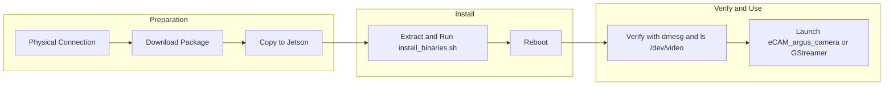

# e-CAM121_CUONX Jetson Setup Guide

*Step-by-step guide for newcomers to Linux camera development — from physical connection to first capture*

---

## Part 1: Concepts (Why This Process Exists)

Before diving into commands, it helps to understand why MIPI CSI cameras require more setup than a typical USB webcam.

### MIPI CSI vs USB Cameras

| Aspect | USB Camera | MIPI CSI Camera (e-CAM121) |
|--------|------------|----------------------------|
| **Connection** | USB cable to host | Ribbon cable directly to SoC connector |
| **Driver** | Generic UVC (plug-and-play) | Vendor-specific kernel driver |
| **Setup** | Usually "just works" | Kernel + device tree update required |

MIPI CSI cameras connect directly to the Jetson's camera interface (CAM1, CAM2, etc.). The kernel must know exactly which sensor is attached and how to talk to it. That information comes from **kernel drivers** and **device tree overlays**.

### Kernel and Drivers

The stock Jetson kernel does not include the Sony IMX412 sensor driver. e-con Systems provides a release package with:

- A **patched kernel** (or prebuilt kernel image) that includes the IMX412 driver
- **Device tree** changes so the kernel knows "CAM1 has an IMX412"
- **ISP tuning** files for image quality
- The **eCAM_argus_camera** application for viewing and capture

When you run `install_binaries.sh`, you are installing these components.

### Device Tree

The device tree is a data structure that describes hardware to the Linux kernel. It tells the kernel: "CAM1 has a 4-lane MIPI IMX412 sensor." Without this, the kernel would not probe the camera even if it is physically connected. The release package patches the device tree so the kernel recognizes the e-CAM121.

### L4T and JetPack

- **L4T** (Linux for Tegra) — NVIDIA's base Linux BSP for Jetson. Each L4T version (e.g., 36.4.4) corresponds to a specific kernel and driver set.
- **JetPack** — L4T plus CUDA, cuDNN, and other NVIDIA libraries. JetPack 6.2.1 uses L4T 36.4.4.

**Important**: The e-con release package is tied to a specific L4T version. Use the package that matches your Jetson's L4T (e.g., L4T 36.4.4 for JetPack 6.2.1).

---

## Part 2: Prerequisites Checklist

Before starting, ensure you have:

- [ ] **Jetson Orin Nano** (or Orin NX) with **JetPack 6.2.1** (L4T 36.4.4)
- [ ] Camera **physically connected to CAM1** — FPC cable, conductive side toward board, connector locked
- [ ] **19V DC power** — USB-C power limits resolutions; use the barrel jack for full 12MP @ 60 fps
- [ ] **Host PC** or direct SSH access to the Jetson for running commands

To check your L4T version on the Jetson:

```bash
head -n 1 /etc/nv_tegra_release
```

---

## Part 3: Step-by-Step Setup



### Step 1: Download the Release Package

1. Go to the e-con Nextcloud share:
   - **URL**: https://spaces.e-consystems.com/nextcloud/index.php/s/w4JWbdgzbgeoreQ
   - **Password**: `e-CAM121_CUONX`
2. Download the archive for your L4T version (e.g., `e-CAM121_CUONX_JETSON_ONX_ONANO_L4T36.4.4_*.tar.gz`).
3. If you need access, contact techsupport@e-consystems.com.

See [Deliverables_Download.md](Deliverables_Download.md) for details.

### Step 2: Copy the Package to the Jetson

Transfer the downloaded `.tar.gz` file to the Jetson. Options:

- **SCP** (from host): `scp e-CAM121_CUONX_*.tar.gz jetson_user@<jetson_ip>:~/`
- **USB drive**: Copy to a USB stick, plug into Jetson, copy to home directory
- **Shared folder**: If using a VM or shared storage

### Step 3: Extract and Run the Install Script

On the Jetson (SSH or local terminal):

```bash
# Extract (replace with your actual filename)
tar -xaf e-CAM121_CUONX_JETSON_ONX_ONANO_L4T36.4.4_07-NOV-2025_R05.tar.gz
cd e-CAM121_CUONX_JETSON_ONX_ONANO_L4T36.4.4_07-NOV-2025_R05

# Run the install script (it will reboot the Jetson when done)
sudo chmod +x ./install_binaries.sh
sudo -E ./install_binaries.sh
```

**What this does**: Installs the patched kernel, device tree overlay, IMX412 driver, ISP tuning files, and the eCAM_argus_camera application. The script reboots the Jetson automatically.

### Step 4: Reboot

If the script did not reboot, reboot manually:

```bash
sudo reboot
```

The new kernel and drivers load on boot.

### Step 5: Verify the Camera

After reboot, confirm the kernel detected the sensor. See Part 4 for what each command means.

---

## Part 4: Verification (What Each Command Means)

Run these on the Jetson after reboot:

### Check Kernel Detection

```bash
sudo dmesg | grep -i "Detected eimx412 sensor"
```

**What it means**: `dmesg` shows kernel log messages. If the IMX412 driver loaded and found the sensor, you will see a line like `Detected eimx412 sensor`. No output usually means the camera is not detected (check connection, L4T version, or install).

### List Video Devices

```bash
ls /dev/video*
```

**What it means**: Linux exposes cameras as **V4L2** (Video4Linux2) device nodes. You should see `/dev/video0` (and possibly `/dev/video1`, etc.). Applications open these nodes to capture frames.

### List V4L2 Devices with Details

```bash
v4l2-ctl --list-devices
```

**What it means**: Shows each video device with its name and capabilities. Useful to confirm the e-CAM121 appears and to see which `/dev/videoN` corresponds to it.

---

## Part 5: Using the Camera

### eCAM_argus_camera (GUI)

The simplest way to view and capture:

```bash
eCAM_argus_camera --device=0
```

- **Stream** live video
- **Capture stills** (JPEG, YUV)
- **Record video** (H.264 on Orin Nano; H.265 on Orin NX)

For multiple cameras or a specific sensor mode:

```bash
eCAM_argus_camera -d 0 --sensormode=0
```

Modes: 0 (4056x3040@60), 1 (4056x3040@30), 2 (2028x1112@240), 3 (2028x1112@60).

See [docs/Argus_App_User_Manual.md](docs/Argus_App_User_Manual.md) for full controls.

### GStreamer (Command Line)

For streaming, recording, or piping into other apps:

```bash
# Stream 1080p to display (replace <n>, <m>, <f> with device, mode, framerate)
gst-launch-1.0 nvarguscamerasrc sensor-id=0 sensor-mode=0 ! \
  "video/x-raw(memory:NVMM), width=4056, height=3040, format=NV12, framerate=60/1" ! \
  queue ! nvvidconv ! "video/x-raw(memory:NVMM), width=1920, height=1080, format=NV12" ! \
  queue ! nv3dsink -e
```

See [docs/GStreamer_Usage_Guide.md](docs/GStreamer_Usage_Guide.md) for more pipelines (still capture, H.264/H.265 recording).

### OpenCV / V4L2

The camera is V4L2-compliant. Any V4L2 application (including OpenCV) can use it. For high-performance OpenCV access, see e-con's article: https://www.e-consystems.com/Articles/Camera/accessing_cameras_in_opencv_with_high_performance.asp

---

## Part 6: Troubleshooting

| Issue | Cause | Solution |
|-------|-------|----------|
| **L4T version mismatch** | Package built for different L4T | Use the release package that matches your L4T (e.g., 36.4.4). Check with `head -n 1 /etc/nv_tegra_release` |
| **No `/dev/video*`** | Camera not detected | Check physical connection (CAM1 only), FPC cable orientation (conductive side toward board), 19V power. Re-run install and reboot. |
| **Camera freeze when switching modes** | Argus mode switch bug | Stop streaming, then launch with explicit mode: `eCAM_argus_camera -d 0 --sensormode=<m>` |
| **Orin Nano: H.265 encode fails** | No NVENC on Orin Nano | Use x264enc (software) for video. See GStreamer guide for H.264 pipeline. |
| **JPEG encoder timeout** | Argus daemon issue | `sudo service nvargus-daemon restart`, then relaunch the app. |

---

## Part 7: Next Steps

- **ROS 2 / Isaac ROS** — Use the camera with `usb_cam`, `v4l2_camera`, or NVIDIA Argus-based nodes. See [physical_ai/poc/POC_01_Camera_Perception.md](../../poc/POC_01_Camera_Perception.md).
- **Jetson full setup** — Docker, Isaac ROS, and development environment: [physical_ai/learning_path/Jetson_Orin_Nano_Setup.md](../../learning_path/Jetson_Orin_Nano_Setup.md).

---

## Reference Documents

| Document | Purpose |
|----------|---------|
| [ECAM121_README.md](ECAM121_README.md) | Quick reference, resolutions, verification |
| [docs/Getting_Started_Manual.md](docs/Getting_Started_Manual.md) | Hardware setup, quick software setup |
| [Software_Package_Manifest.md](Software_Package_Manifest.md) | Package structure, what install_binaries.sh installs |
| [Deliverables_Download.md](Deliverables_Download.md) | Download URL and password |
